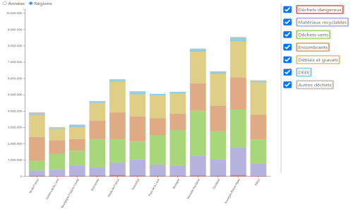

# DatavizDechet

Cette page a pour but de visualiser les données de [déchets de France](https://data.ademe.fr/datasets/sinoe-(r)-destination-des-dechets-collectes-en-decheterie-par-type-de-traitement).
Pour les visualiser, l'utilisateur a à disposition:
  - Une carte des régions visualisant le tonnage des déchets produits suivant son type et/ou son traitement
  - Un diagramme en barre permettant de comparer le tonnage des déchets suivant les années ou région
  - Un diagramme ciculaire permettant d'avoir le pourcentage de chaque tonnage en fonction de paramètres
  
The goal of this page is to have a visualisation of [French waste](https://data.ademe.fr/datasets/sinoe-(r)-destination-des-dechets-collectes-en-decheterie-par-type-de-traitement).
To do so, one can use:
  - A region map, to have the tonnage depending on its type of the way it is treated
  - A stacked barplot to compare waste depending on its region or year
  - A pie chart to have the tonnage percent with different factors

### Miro
[board](https://miro.com/app/board/o9J_ldqDWKQ=/)
### Données
[dataset](https://data.ademe.fr/datasets/sinoe-(r)-destination-des-dechets-collectes-en-decheterie-par-type-de-traitement)
### Autres
[notes](https://docs.google.com/document/d/1FUSumXtkg79WmLqTyoVnoboqp2kkC0KnIgTtlWr6eGU/edit) 

[document de cadrage](https://docs.google.com/document/d/1_Et-eeZRNxkB_b8JNc-MjTSsS9XBjO0KMVi392lnJmI/edit)

[gh page](https://lamborot-eliot.github.io/DatavizDechet/)

### Thumbnail
